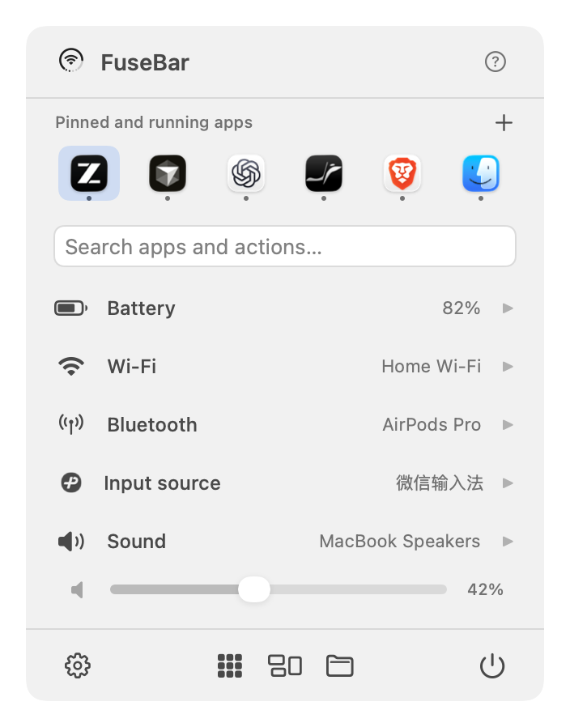
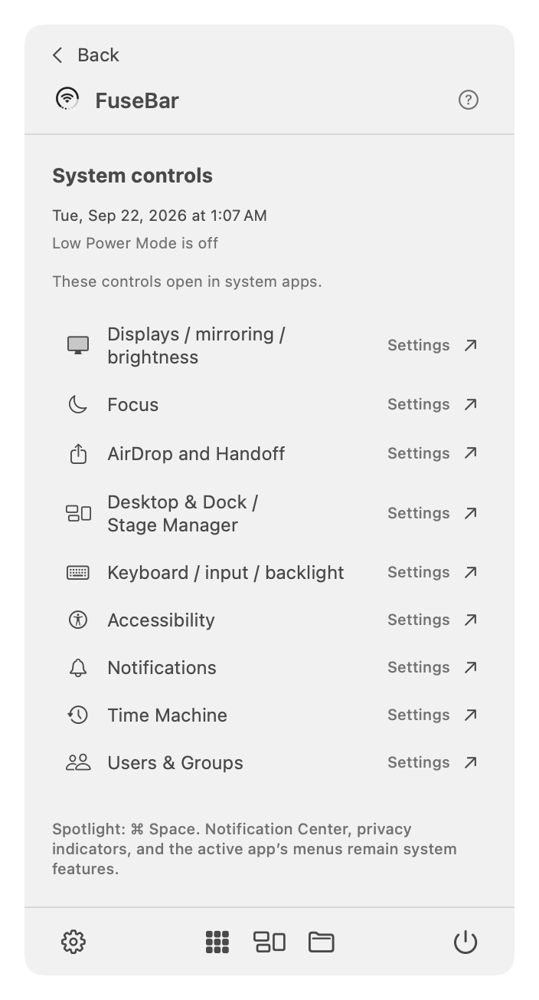
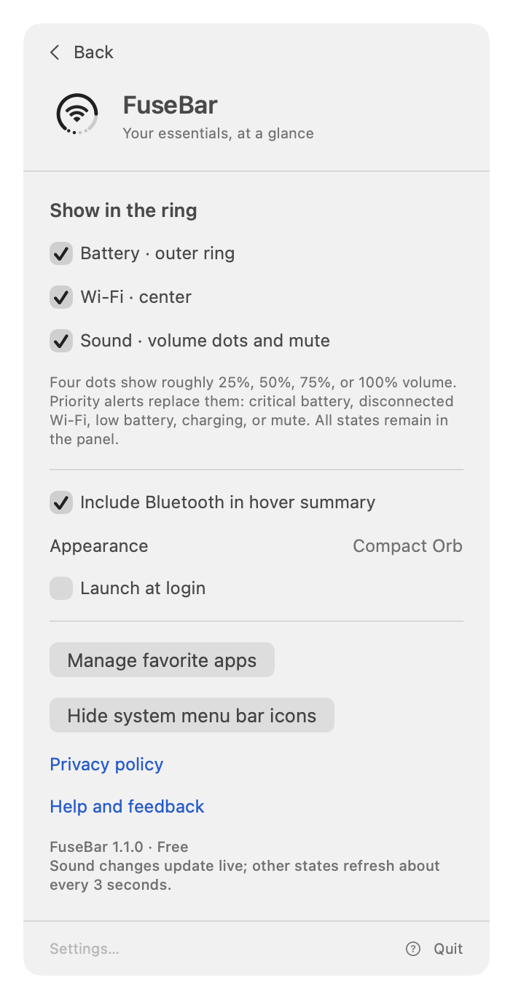
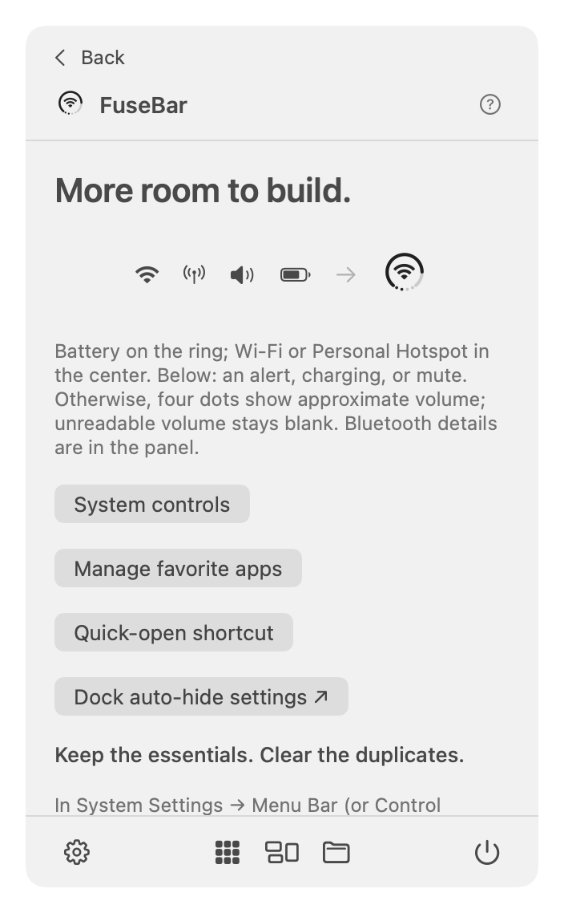

# FuseBar

**Essential Mac status, together in one menu bar icon.** Free, native, and local. Requires macOS 14 or later.


FuseBar combines battery level, Wi-Fi/hotspot status, and four volume dots that give way to priority alerts in a compact menu bar entry. Click it to see battery, Wi-Fi, Bluetooth, and audio details or adjust supported output devices' volume. No account, ads, subscription, or analytics.

## Preview

[Watch the 34-second FuseBar film](https://github.com/huanglizhuo/FuseBar/releases/download/v1.0.1/FuseBar-launch-v2.mp4).




<details>
<summary>Preferences and first-use guide</summary>




</details>

*Native UI previews of version 1.1.0, rendered with sample status and a local running-app list. These are not live hardware verification captures. The film above shows the earlier icon-fusion design.*

## Download and use

Download the latest published build, [FuseBar 1.0.1 for macOS](https://github.com/huanglizhuo/FuseBar/releases/download/v1.0.1/FuseBar-1.0.1-macOS.zip), signed with Developer ID and notarized by Apple. See its [release notes and checksums](https://github.com/huanglizhuo/FuseBar/releases/tag/v1.0.1). **Version 1.1.0 source and the previews above are ready; its downloadable release is pending Apple signing/notarization.** The existing Mac App Store submission is under review and unchanged; 1.1.0 is planned for GitHub only.

Move FuseBar to Applications and launch it. **FuseBar lives in the menu bar and does not show a Dock icon.** Click its ring to open the panel and first-use guide. **English, Simplified Chinese, Japanese, French, and Spanish** are supported. FuseBar follows your Mac’s preferred language list (including regional variants), falling back to English when none match. Chinese variants use Simplified Chinese. Restart FuseBar after changing the system or per-app language.

You can manually hide redundant system icons in System Settings → Menu Bar (Control Center on older macOS versions). FuseBar does not automatically hide, move, or modify other apps' menu bar items.

## Features

Version 1.1.0 adds five-language support and an expanded control panel.

- Battery ring with charging, low-battery, unknown, and no-internal-battery states.
- Wi-Fi connection and signal strength, with an optional network name. Personal Hotspot-class metered Wi-Fi paths use a chain-link icon.
- Four dots show approximate volume in 25% steps; unreadable volume stays blank. A stable, centered bottom indicator takes over for alerts: critical battery → disconnected Wi-Fi → low battery → charging → mute. Other details remain in the panel.
- On-demand Wi-Fi scanning and joining supported personal networks, with explicit confirmation. Other authentication methods open System Settings.
- Optional Bluetooth power and paired-device details; connection, pairing, and power changes open System Settings.
- Sound output selection, supported mute/volume controls, and immediate CoreAudio updates.
- Up to two rows of running apps, with an overflow list and pinned favorites.
- Compact app launcher and Mission Control shortcuts; user-selected files and folders saved as local bookmarks.
- Explicit system handoffs for displays, Focus, AirDrop/Handoff, Desktop & Dock, accessibility, and more.
- Native SwiftUI/AppKit panel, monochrome menu bar rendering, saved preferences, and user-controlled launch at login.
- An original layered Liquid Glass app icon built with Apple's Icon Composer.

## Privacy

Status information stays on your Mac. Bluetooth permission is optional. macOS location permission is only requested when you choose to allow Wi-Fi network names and nearby-network scans; FuseBar does not request location coordinates or start location updates. Basic features remain available when optional permissions are declined.

Read the [privacy policy](docs/PRIVACY.md). Report issues through [GitHub Issues](https://github.com/huanglizhuo/FuseBar/issues).

## Build

Open `FuseBar.xcodeproj` and select the **FuseBar** scheme. Configure your signing team for signed builds. To build locally without a developer certificate:

```sh
xcodebuild -project FuseBar.xcodeproj -scheme FuseBar -configuration Debug \
  -derivedDataPath build CODE_SIGN_IDENTITY=- CODE_SIGN_STYLE=Manual build
open build/Build/Products/Debug/FuseBar.app
```

For the configured development team:

```sh
zsh Scripts/build.sh
zsh Scripts/test.sh
```

`project.yml` is the source of truth for the project. Run `xcodegen generate` after adding files or changing build configuration. Building the committed Xcode project does not require XcodeGen. There are no third-party runtime dependencies.

## Limitations and validation

Sound and network changes trigger updates; a three-second poll provides a fallback for other states. Monitoring pauses during sleep and resumes after wake. Wi-Fi association does not establish internet reachability. Bluetooth enumeration may not include every BLE peripheral. External audio devices may not support software volume control; changing volume does not automatically unmute them.

System features such as Notification Center, privacy indicators, and the active app’s menu remain controlled by macOS. See the [capability map](docs/SYSTEM_CAPABILITY_RESEARCH.md) for direct controls versus system handoffs.

See [validation notes](docs/VALIDATION.md) for observed results and remaining compatibility checks. Rendered fixture galleries are design previews, not evidence of live hardware behavior. Do not distribute locally signed development builds as notarized releases.

## Project notes

- [Product and implementation plan](docs/PLAN.md)
- [Release workflow](Distribution/README.md)
- [Distribution checklist](docs/APP_STORE_RELEASE.md)
- [App icon source and design](Design/AppIcon/DESIGN.md)
- [Original PRD](docs/Original-PRD.md)

Previously named MergeBar; the registered bundle identifier is retained for continuity. The visual layout was inspired by [CircleStatusBar](https://github.com/artemnovichkov/CircleStatusBar). FuseBar's native drawing and system integration are independently implemented. The promotional video's adapted animation is credited in [third-party notices](videos/fusebar-launch/THIRD_PARTY_NOTICES.md).
