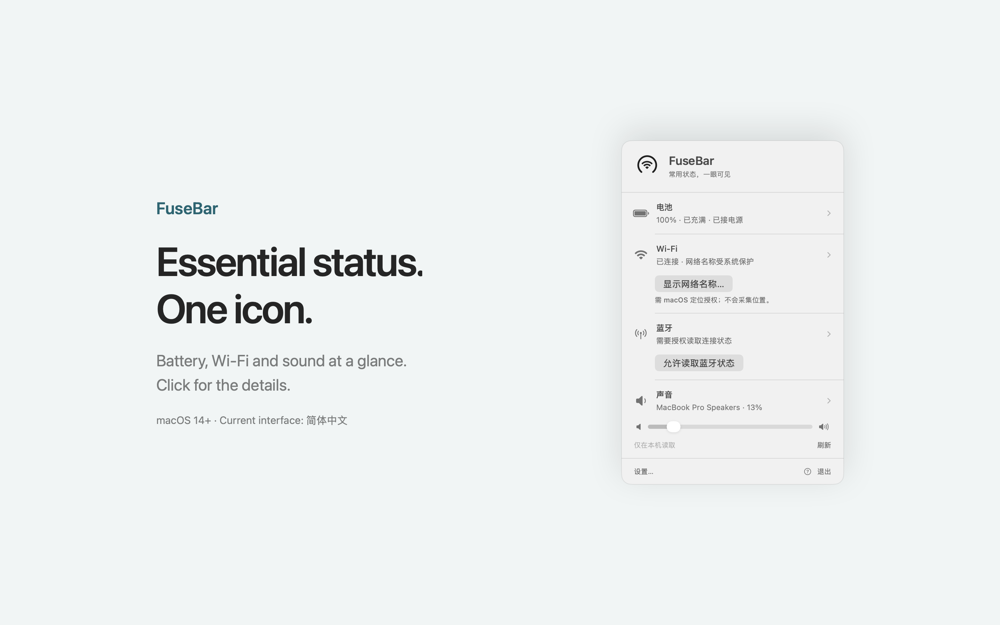
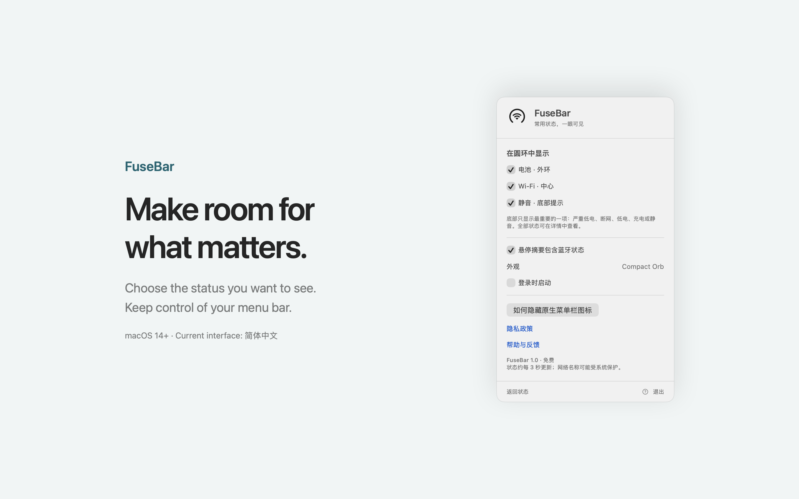
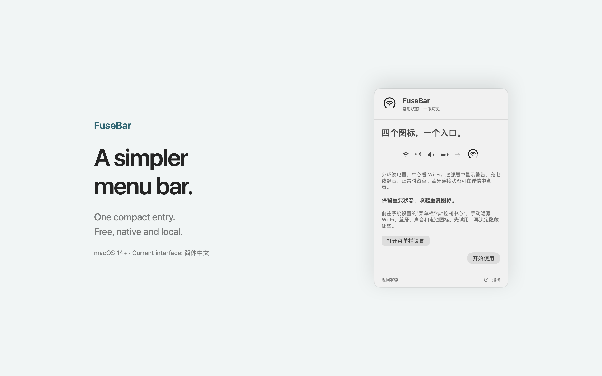

# FuseBar

**Essential Mac status, together in one menu bar icon.** Free, native, and local. Requires macOS 14 or later.


FuseBar combines battery level, Wi-Fi/hotspot status, and four volume dots that give way to priority alerts in a compact menu bar entry. Click it to see battery, Wi-Fi, Bluetooth, and audio details or adjust supported output devices' volume. No account, ads, subscription, or analytics.

## Preview



<details>
<summary>Preferences and first-use guide</summary>





</details>

## Download and use

Download [FuseBar 1.0 for macOS](https://github.com/huanglizhuo/MergeBar/releases/download/v1.0/FuseBar-1.0-macOS.zip), signed with Developer ID and notarized by Apple. See [release notes and checksums](https://github.com/huanglizhuo/MergeBar/releases/tag/v1.0). The Mac App Store version has been added for review (Ready for Review); it is not yet available on the store.

Move FuseBar to Applications and launch it. **FuseBar lives in the menu bar and does not show a Dock icon.** Click its ring to open the panel and first-use guide. The current app interface is Simplified Chinese.

You can manually hide redundant system icons in System Settings → Menu Bar (Control Center on older macOS versions). FuseBar does not automatically hide, move, or modify other apps' menu bar items.

## Features

The volume dots and hotspot fix below are in the current development build; the existing 1.0 download predates these changes.

- Battery ring with charging, low-battery, unknown, and no-internal-battery states.
- Wi-Fi connection and signal strength, with an optional network name. Personal Hotspot-class metered Wi-Fi paths use a chain-link icon.
- Four dots show approximate volume in 25% steps; unreadable volume stays blank. A stable, centered bottom indicator takes over for alerts: critical battery → disconnected Wi-Fi → low battery → charging → mute. Other details remain in the panel.
- Optional Bluetooth power and connected paired-device details; no scanning or pairing.
- Output volume and mute status, plus volume adjustment where supported by the device.
- Native SwiftUI/AppKit panel, monochrome menu bar rendering, saved preferences, and user-controlled launch at login.
- An original layered Liquid Glass app icon built with Apple's Icon Composer.

## Privacy

Status information stays on your Mac. Bluetooth permission is optional. macOS location permission is only requested when you choose to show the Wi-Fi network name; FuseBar does not request location coordinates or start location updates. Basic features remain available when optional permissions are declined.

Read the [privacy policy](docs/PRIVACY.md). Report issues through [GitHub Issues](https://github.com/huanglizhuo/MergeBar/issues).

## Build

Open `FuseBar.xcodeproj` and select the **FuseBar** scheme. Configure your signing team for signed builds. To build locally without a developer certificate:

```sh
xcodebuild -project FuseBar.xcodeproj -scheme FuseBar -configuration Debug \
  -derivedDataPath build CODE_SIGN_IDENTITY=- CODE_SIGN_STYLE=Manual build
open build/Build/Products/Debug/FuseBar.app
```

For the configured development team:

```sh
zsh Scripts/build.sh
zsh Scripts/test.sh
```

`project.yml` is the source of truth for the project. Run `xcodegen generate` after adding files or changing build configuration. Building the committed Xcode project does not require XcodeGen. There are no third-party runtime dependencies.

## Limitations and validation

Status refreshes approximately every three seconds, pauses during sleep, and resumes after wake. Wi-Fi association does not establish internet reachability. Bluetooth enumeration may not include every BLE peripheral. External audio devices may not support software volume control; changing volume does not automatically unmute them.

See [validation notes](docs/VALIDATION.md) for observed results and remaining compatibility checks. Rendered fixture galleries are design previews, not evidence of live hardware behavior. Do not distribute locally signed development builds as notarized releases.

## Project notes

- [Product and implementation plan](docs/PLAN.md)
- [Release workflow](Distribution/README.md)
- [Distribution checklist](docs/APP_STORE_RELEASE.md)
- [App icon source and design](Design/AppIcon/DESIGN.md)
- [Original PRD](docs/Original-PRD.md)

Previously named MergeBar; the GitHub repository URL and registered bundle identifier are retained for continuity. The visual layout was inspired by [CircleStatusBar](https://github.com/artemnovichkov/CircleStatusBar). FuseBar's native drawing and system integration are independently implemented. The promotional video's adapted animation is credited in [third-party notices](videos/fusebar-launch/THIRD_PARTY_NOTICES.md).
