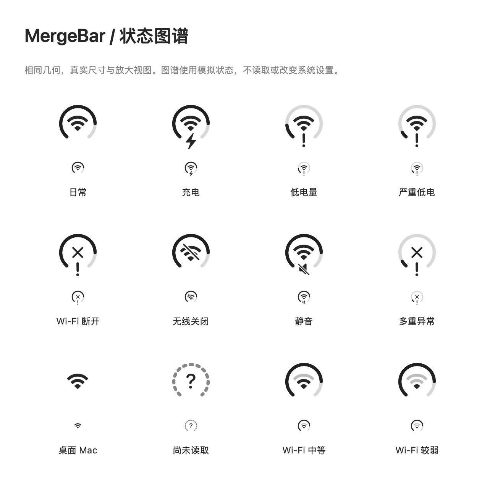

# MergeBar

**四个菜单栏图标，一个状态入口。** 原生 macOS 14+ 开发预览，SwiftUI + AppKit，无运行依赖。


应用图标使用原生 Icon Composer 分层 Liquid Glass 资源，支持系统外观适配；[设计与重建说明](Design/AppIcon/DESIGN.md)。



电池外环、Wi-Fi 中心、底部居中的单一状态提示。底部按严重低电、断网、低电、充电、静音的优先级显示，正常时留空；蓝牙连接状态移至详情与悬停摘要。点击查看完整状态、调整支持设备的音量、前往系统设置。默认没有 Dock 图标。

## 运行

打开 `MergeBar.xcodeproj`，选择 **MergeBar → My Mac**，按 Run。已配置本地 ad-hoc 签名，无需开发者账号。

或运行：

```sh
zsh Scripts/build.sh
open build/Build/Products/Debug/MergeBar.app
```

首次使用点击菜单栏圆环，阅读引导并选择“开始使用”。按需在系统设置 → 菜单栏（旧版为控制中心）手动隐藏原生图标。可先只隐藏电池和 Wi-Fi，再逐步尝试四合一。

## 已实现

- IOKit 内置电池电量、充电/接电状态；无电池与读取未知独立处理。
- CoreWLAN Wi-Fi 开关、关联状态、信号档位；可选定位授权后显示 SSID。
- 用户授权后读取蓝牙电源与已连接的配对设备；不扫描或配对设备。
- CoreAudio 默认输出音量与静音；主音量或双声道音量控制，不能写入时禁用滑块。
- 单色圆环、完整 tooltip/VoiceOver 描述、原生 Popover、引导、图标及蓝牙悬停摘要偏好持久化、SMAppService 登录启动。
- 后台串行读取，约 3 秒刷新；休眠停止计时，唤醒刷新；模拟状态图谱。

## 验证

```sh
zsh Scripts/test.sh
build/Build/Products/Debug/MergeBar.app/Contents/MacOS/MergeBar --render-gallery "$PWD/docs/previews"
```

需要本机图形会话和 XCTest 服务，受限沙箱可能无法运行测试宿主或渲染。测试涵盖状态阈值、优先级、偏好恢复与只读系统适配器。

工程配置源是 `project.yml`。增加文件后安装/使用 XcodeGen 执行 `xcodegen generate`；仅构建已生成的 Xcode 工程不需要 XcodeGen。

## 限制

- 这是开发预览，轮询不是事件级实时；长期能耗、VoiceOver 实机操作、多版本和 Intel 真机验证尚未完成。
- Wi-Fi 关联不表示互联网可达。SSID 受系统隐私限制，拒绝权限仍可使用其余功能。应用不请求位置坐标。
- 蓝牙仅列出系统可枚举的已配对连接，不保证包含所有 BLE 外设。
- 系统静音独立于音量。调音量不会强行解除静音；复杂多声道、聚合或外置设备需要进一步验证。
- 设置 URL 是兼容性便利入口；不同 macOS 版本可能只打开系统设置首页，届时搜索相应面板。
- 登录启动需要真实 app bundle，系统可能要求批准；正式使用建议将应用放入 `/Applications` 后开启。程序不会自行启用登录启动。
- 正式对外分发前需要 Developer ID 签名、公证和完整兼容性验收。

## 规划与出处

- [产品与实施计划](docs/PLAN.md)
- [原始 PRD](docs/Original-PRD.md)
- [验收记录](docs/VALIDATION.md)
- 视觉结构参考 [CircleStatusBar](https://github.com/artemnovichkov/CircleStatusBar)。已研究其最终圆环、中心 Wi-Fi 与底部点的布局；本工程独立实现状态绘制和系统适配，不包含参考项目代码或媒体。
