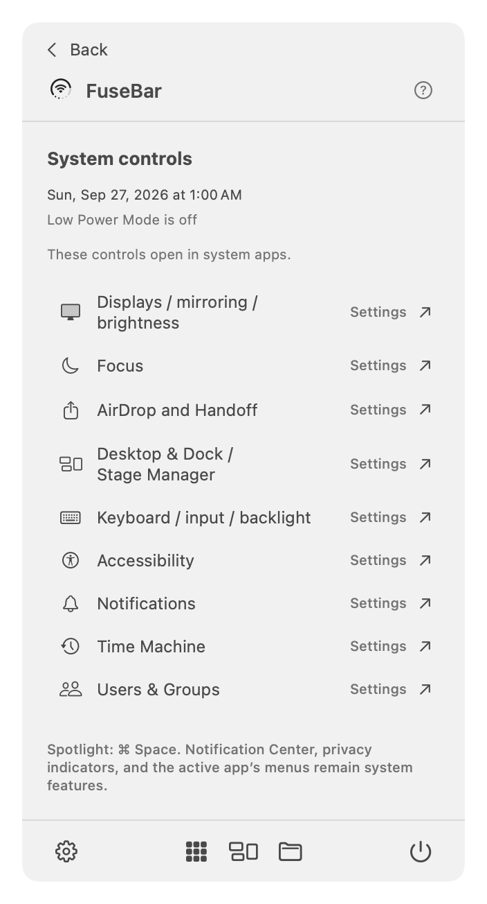

# FuseBar

**More room for code. Your Mac essentials in one menu bar.** Free, native, and local. Requires macOS 14 or later.


FuseBar brings system status, recently used apps, input sources, and project shortcuts into one compact menu bar panel. Enable Dock auto-hide in macOS to make more room for your editor and preview, then use FuseBar to get back to your tools. No account, ads, subscription, or analytics.

## Preview


*20-second intro with Chinese and English captions (silent preview). [Watch with sound (MP4)](https://github.com/huanglizhuo/FuseBar/releases/download/v1.2.0/FuseBar-intro-20s.mp4). Built with [HyperFrames](https://github.com/heygen-com/hyperframes) from the app's own panel renders; the orb animation reuses the choreography in `OrbMorphAnimation.swift`.*


<details>
<summary>Status layout, side submenus, input sources, preferences, projects, and system controls</summary>




</details>

*Native UI previews rendered from FuseBar 1.2.0 source on September 27, 2026, with sample status, local running apps, and local input-source names/icons. They are not live hardware verification captures. See the [screenshot index](docs/previews/README.md) for all five interface languages.*

## Download and use

Download the latest published build, [FuseBar 1.2.0 for macOS](https://github.com/huanglizhuo/FuseBar/releases/download/v1.2.0/FuseBar-1.2.0-macOS.zip), signed with Developer ID and notarized by Apple. See its [release notes and checksums](https://github.com/huanglizhuo/FuseBar/releases/tag/v1.2.0). The screenshots and features below describe this release. This update does not change the existing Mac App Store submission.

Move FuseBar to Applications and launch it. **FuseBar lives in the menu bar and does not show a Dock icon.** Click its ring to open the panel and first-use guide. **English, Simplified Chinese, Japanese, French, and Spanish** are supported. FuseBar follows your Mac’s preferred language list (including regional variants), falling back to English when none match. Chinese variants use Simplified Chinese. Restart FuseBar after changing the system or per-app language.

You can manually hide redundant system icons in System Settings → Menu Bar (Control Center on older macOS versions). FuseBar does not automatically hide, move, or modify other apps' menu bar items.

## Features

FuseBar 1.2.0 includes:

- Battery ring with charging, low-battery, unknown, and no-internal-battery states.
- Wi-Fi connection and signal strength, with an optional network name. Personal Hotspot-class metered Wi-Fi paths use a chain-link icon.
- Four dots show approximate volume in 25% steps; unreadable volume stays blank. A stable, centered bottom indicator takes over for alerts: critical battery → disconnected Wi-Fi → low battery → charging → mute. Other details remain in the panel.
- On-demand Wi-Fi scanning and joining supported personal networks, with explicit confirmation. Other authentication methods open System Settings.
- Optional Bluetooth power and paired-device details; click a device to connect or disconnect with progress and verified state. Pairing and power changes remain in System Settings. Renamed Bluetooth audio devices use the system audio name when an exact device identity match is available.
- Sound output selection, an inline mute button, supported volume controls, and immediate CoreAudio updates.
- Unified search for installed apps, saved file shortcuts, and actions, with real app icons and keyboard navigation; results appear only while typing.
- Compact status rows with highlighted side-submenu selection, theme-aware icons, and hover feedback.
- Up to 12 running apps above search, ordered by recent use or launch. Right-click an app to Force Quit it. Recent order stays on your Mac.
- Choose Network connection or Sound output as the default center icon in Settings; changes apply immediately and persist locally.
- Input-source selection with native icons. Switching briefly shows the source in the center for two seconds; Settings can keep it visible. Internal input-method modes may not be detectable.
- Centered footer shortcuts for the app launcher, Mission Control, and files. Settings is at the lower left, Quit uses a power icon at the lower right, and help is at the upper right.
- User-selected files and folders saved as local bookmarks. Clicking outside FuseBar closes its menus without canceling an open system picker.
- Explicit system handoffs for displays, Focus, AirDrop/Handoff, Desktop & Dock, accessibility, and more.
- Native SwiftUI/AppKit panel, monochrome menu bar rendering, saved preferences, and user-controlled launch at login.
- An original layered Liquid Glass app icon built with Apple's Icon Composer.

## Make room for coding

Enable **Coding layout** in Settings for compact status icons, running apps above search, and a selected project's folder, preview, and repository links. Apps that are not running are one search away: type in the home panel to find anything installed in your application folders.

In **Settings → Quick-open shortcut**, click **Record shortcut** and press a combination with at least two modifiers, including Command or Control. No shortcut is reserved until you choose one. A successful registration is saved; unavailable/system combinations leave your previous setting intact. Press the shortcut to open FuseBar with search focused, or again to close it. Search focuses when the panel opens. Use ↑/↓ and Return to choose a result, → to expand a focused status, and ← to close its submenu. Escape closes the submenu first, then the main panel; Escape during recording cancels recording.

Enable Dock auto-hide yourself through the supplied **Dock auto-hide settings** link, and restore it there at any time. Project links open only the entries you save; they do not start servers or restore editor sessions. See the [implementation scope](docs/CODING_WORKSPACE_PLAN.md) and [validation limits](docs/VALIDATION.md).

## Input sources and navigation

Input Source sits alongside Battery, Wi-Fi, Bluetooth, and Sound. Click its row (or its compact button in Coding layout) to choose an enabled input source. The selected source is marked with a check. Its native icon appears in the ring for two seconds after a change; enable **Always show the input source in the center** in Settings to keep it there. Icons follow light/dark appearance and fall back to a language label when unavailable. Switching modes inside a third-party input method may not change the system input source.

App icons are ordered by recent activation or launch, even while the panel is closed. Up to 100 app identifiers are stored locally to preserve that order. Unrecorded running apps use launch time as a fallback. Quit apps leave the shelf and stay reachable through search.

Battery, Wi-Fi, Bluetooth, Sound, and Input Source open in a separate side submenu while the main panel stays visible. Click another status to switch the submenu; click the same status again or press Escape to close it. Escape again closes the main panel. AppKit places the submenu on the left when the right edge has insufficient room. Battery includes a link to macOS settings. Settings, project editing, and other utility pages keep in-panel navigation.

## Privacy

Status information stays on your Mac. Bluetooth permission is optional. macOS location permission is only requested when you choose to allow Wi-Fi network names and nearby-network scans; FuseBar does not request location coordinates or start location updates. Basic features remain available when optional permissions are declined.

Read the [privacy policy](docs/PRIVACY.md). Report issues through [GitHub Issues](https://github.com/huanglizhuo/FuseBar/issues).

## Build

Open `FuseBar.xcodeproj` and select the **FuseBar** scheme. Configure your signing team for signed builds. To build locally without a developer certificate:

```sh
xcodebuild -project FuseBar.xcodeproj -scheme FuseBar -configuration Debug \
  -derivedDataPath build CODE_SIGN_IDENTITY=- CODE_SIGN_STYLE=Manual build
open build/Build/Products/Debug/FuseBar.app
```

For the configured development team:

```sh
zsh Scripts/build.sh
zsh Scripts/test.sh
```

`project.yml` is the source of truth for the project. Run `xcodegen generate` after adding files or changing build configuration. Building the committed Xcode project does not require XcodeGen. There are no third-party runtime dependencies.

## Limitations and validation

Sound and network changes trigger updates; a three-second poll provides a fallback for other states. Monitoring pauses during sleep and resumes after wake. Wi-Fi association does not establish internet reachability. Bluetooth enumeration may not include every BLE peripheral. External audio devices may not support software volume control; changing volume does not automatically unmute them.

System features such as Notification Center, privacy indicators, and the active app’s menu remain controlled by macOS. See the [capability map](docs/SYSTEM_CAPABILITY_RESEARCH.md) for direct controls versus system handoffs.

See [validation notes](docs/VALIDATION.md) for observed results and remaining compatibility checks. Rendered fixture galleries are design previews, not evidence of live hardware behavior. Do not distribute locally signed development builds as notarized releases.

## Project notes

- [Product and implementation plan](docs/PLAN.md)
- [Release workflow](Distribution/README.md)
- [Distribution checklist](docs/APP_STORE_RELEASE.md)
- [App icon source and design](Design/AppIcon/DESIGN.md)
- [Original PRD](docs/Original-PRD.md)

The visual layout was inspired by [CircleStatusBar](https://github.com/artemnovichkov/CircleStatusBar). FuseBar's native drawing and system integration are independently implemented.
