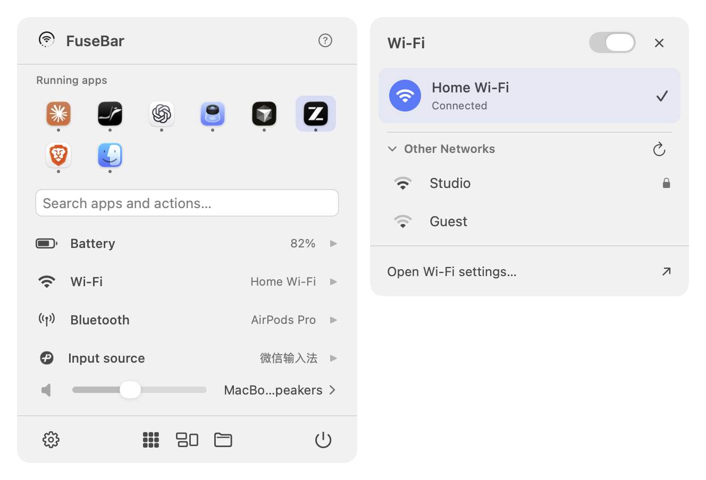
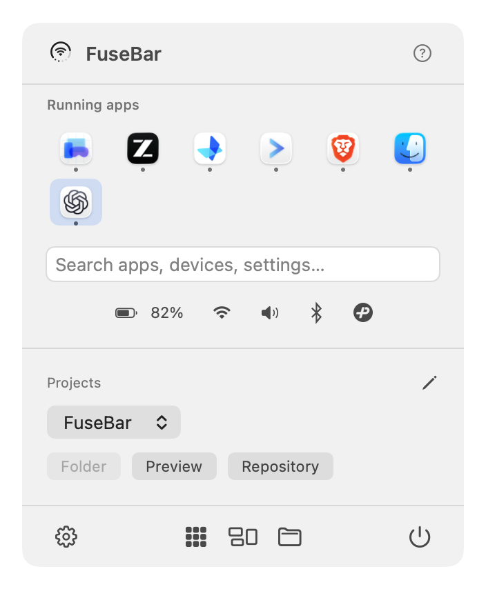
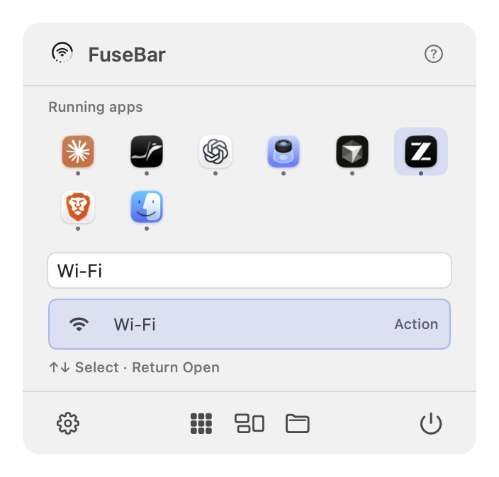
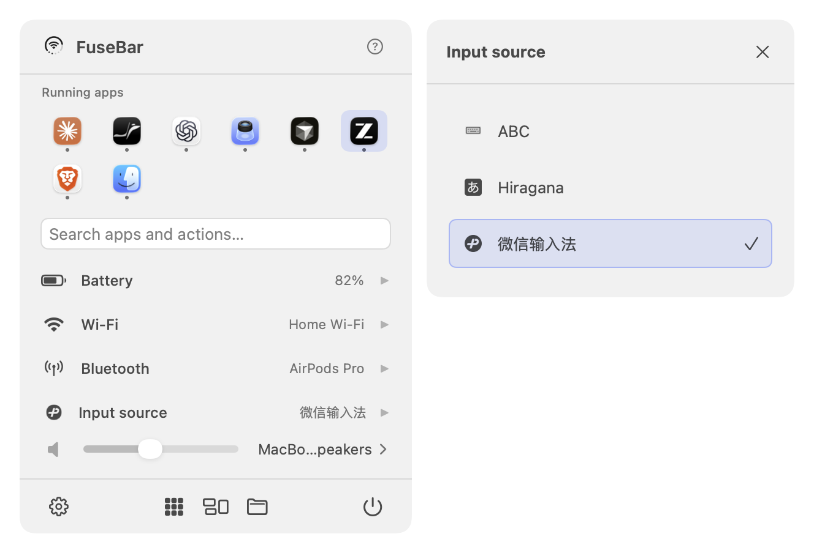
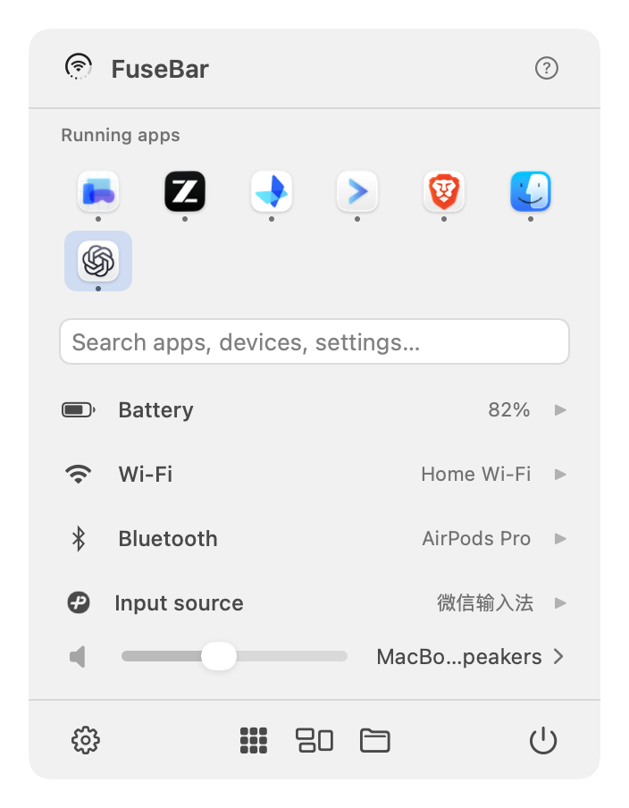
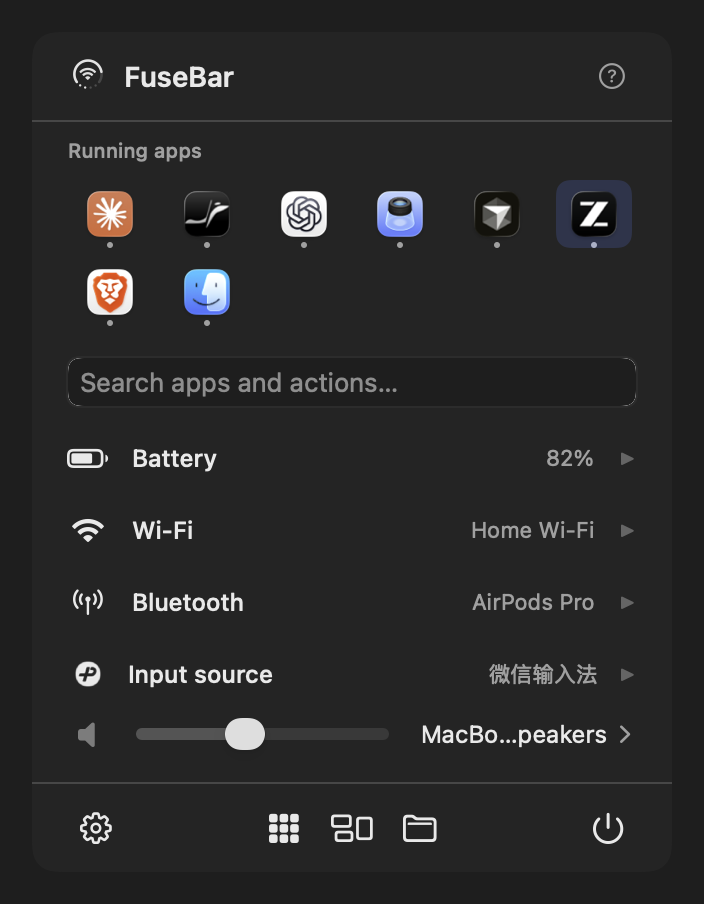
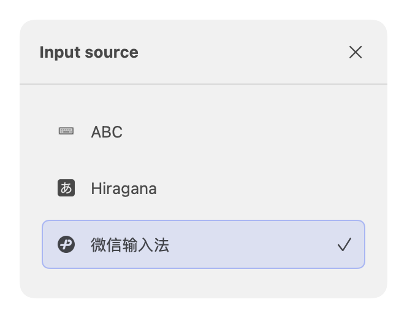
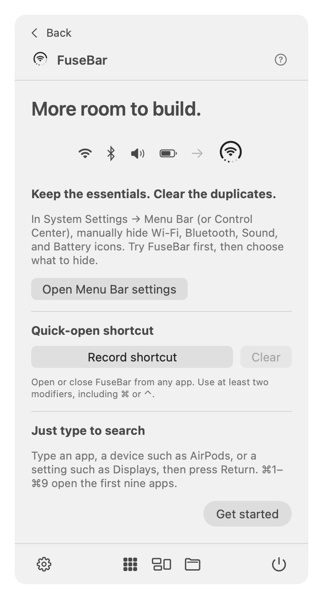
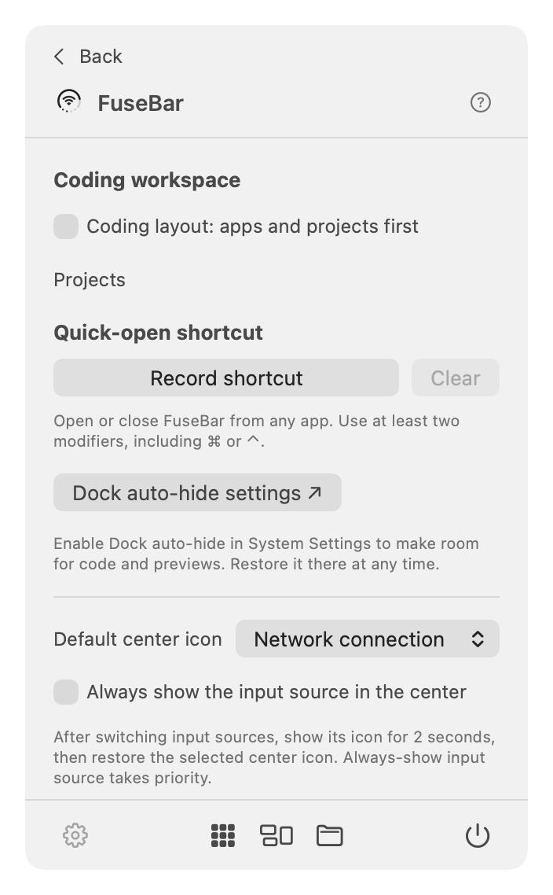
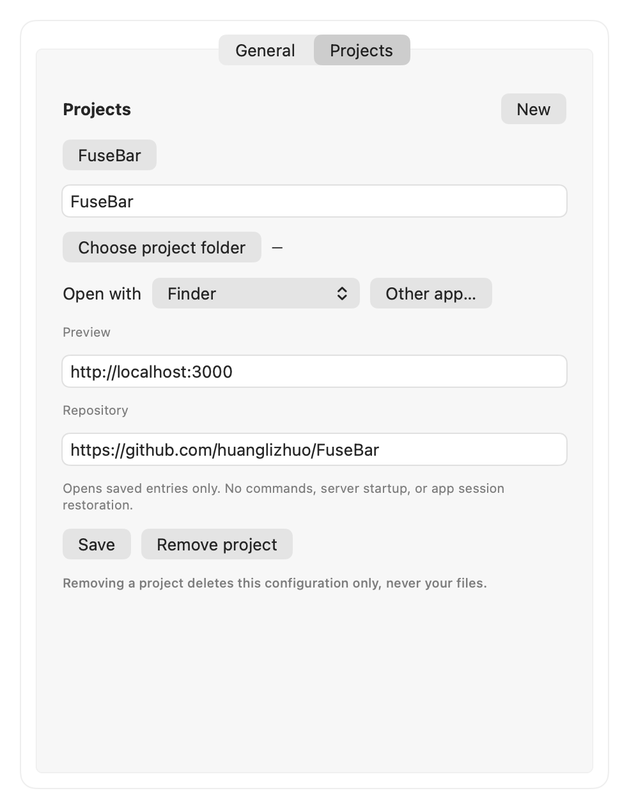

# FuseBar

**English** · [简体中文](README.zh-Hans.md)


**More room for code. Your Mac essentials in one menu bar.**

FuseBar puts system status, running apps, input sources, and project shortcuts into one compact menu bar panel. Hide the Dock to give your editor more room, and use FuseBar to get back to everything else: type to open an app, switch the sound output, connect a Bluetooth device, or open a System Settings pane.

Free and native for macOS 14 or later. No account, ads, subscription, or analytics.


## Download

Get the latest version from [GitHub Releases](https://github.com/huanglizhuo/FuseBar/releases/latest). The app is universal (Apple silicon and Intel), signed with Developer ID, and notarized by Apple. FuseBar is not on the Mac App Store.

Move FuseBar to Applications and open it. It lives in the menu bar and has no Dock icon: click its ring to open the panel and the first-run guide. FuseBar is available in English, Simplified Chinese, Japanese, French, and Spanish, and follows your Mac's preferred languages.

## Features

- **Status ring.** Battery around the ring, network or sound output in the center, and volume as four dots. A marker at the bottom flags critical battery, lost or unusable Wi-Fi, low battery, charging, or mute; Settings can show the battery or volume percentage there instead. Values FuseBar can't read stay blank or show as unknown.
- **Side menus.** Battery shows time remaining and Low Power Mode. Wi-Fi scans and joins personal networks. Bluetooth connects and disconnects paired devices. Sound switches the output and sets the volume.
- **Search.** Type to open any installed app by name, initials ("vsc"), or pinyin ("wx" for 微信). The same box switches sound outputs, connects Bluetooth devices, changes input sources, and opens projects, saved files, and System Settings panes. Each result says what Return will do.
- **Running apps.** Up to 12 above search, most recent first. ⌘1–⌘9 open the first nine; right-click to hide, reveal in Finder, or force quit.
- **Input sources.** Pick any enabled input source by its native icon. After a switch, the ring shows the new source for two seconds, or always if you prefer.
- **Coding layout.** Compact status icons plus each project's folder, preview, and repository links. Open the folder in the app you choose, such as Finder, Visual Studio Code, Cursor, Zed, Xcode, or Terminal.
- **Keyboard.** Record a quick-open shortcut to open FuseBar with search focused. ↑/↓ and Return pick a result, even while pinyin is composing; → opens a status's side menu and ← closes it; Escape closes the side menu, then the panel.
- **Diagnostics.** Settings can copy a summary without Wi-Fi, device, file, or project names for a bug report. FuseBar never checks for updates in the background.

## Screenshots






<details>
<summary>More: side submenus, dark appearance, input sources, first-run guide, and Settings</summary>












</details>

The intro and screenshots use offscreen renders of FuseBar with sample data, not recordings of live hardware. See the [screenshot index](docs/previews/README.md) for all five languages.

## Privacy

Your data stays on your Mac. Bluetooth access is optional. Location permission is requested only if you want Wi-Fi network names and nearby-network scans, and FuseBar never asks for your coordinates. Basic features keep working if you decline. Read the [privacy policy](docs/PRIVACY.md).

## Limitations

- FuseBar never hides, moves, or changes other menu bar icons or your Dock settings. Hide duplicate system icons in System Settings → Menu Bar (Control Center on older macOS), and turn on Dock auto-hide yourself through the **Dock auto-hide settings** link.
- Notification Center, privacy indicators, and the active app's menus stay under macOS control. See the [capability map](docs/SYSTEM_CAPABILITY_RESEARCH.md) (Chinese).
- Wi-Fi status shows the connection, not whether the internet is reachable. Some Bluetooth LE accessories may not be listed, and some external audio devices don't support software volume.
- Switching modes inside a third-party input method may not change the system input source.

Hardware coverage and open checks are tracked in the [validation notes](docs/VALIDATION.md) (mostly Chinese).

## Build

Open `FuseBar.xcodeproj` and choose the **FuseBar** scheme. To build without a developer certificate:

```sh
xcodebuild -project FuseBar.xcodeproj -scheme FuseBar -configuration Debug \
  -derivedDataPath build CODE_SIGN_IDENTITY=- CODE_SIGN_STYLE=Manual build
open build/Build/Products/Debug/FuseBar.app
```

With the configured development team, run `zsh Scripts/build.sh` and `zsh Scripts/test.sh`. `project.yml` is the source of truth: run `xcodegen generate` after adding files or changing build settings. There are no third-party runtime dependencies.

## More

- [Release workflow](Distribution/README.md) · [Product plan](docs/PLAN.md) (Chinese) · [App icon design](Design/AppIcon/DESIGN.md) (Chinese)
- Report bugs and ideas in [GitHub Issues](https://github.com/huanglizhuo/FuseBar/issues).
- The visual layout was inspired by [CircleStatusBar](https://github.com/artemnovichkov/CircleStatusBar). FuseBar's drawing and system integration are implemented independently.
