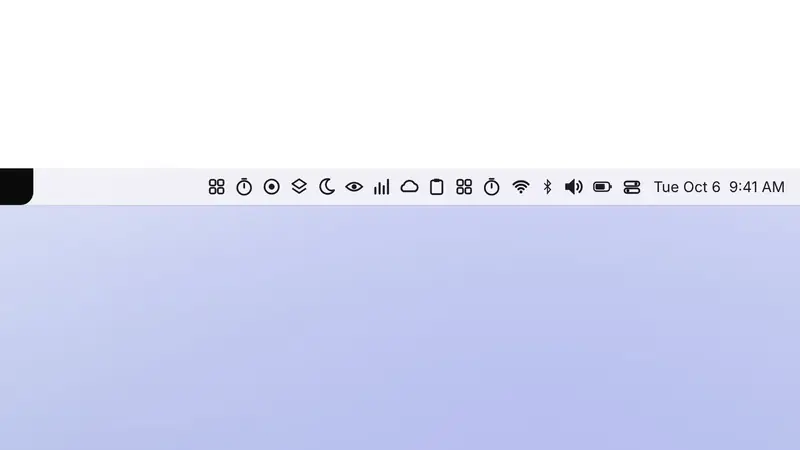
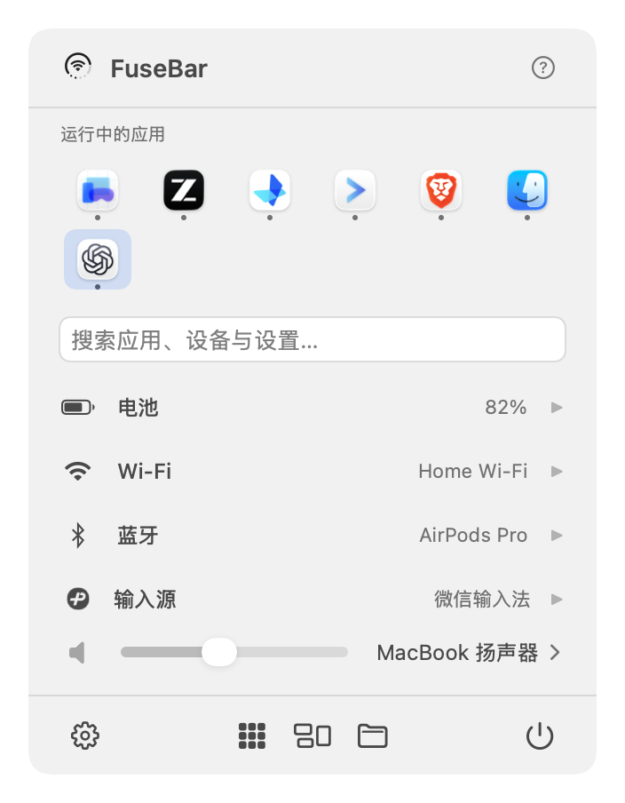
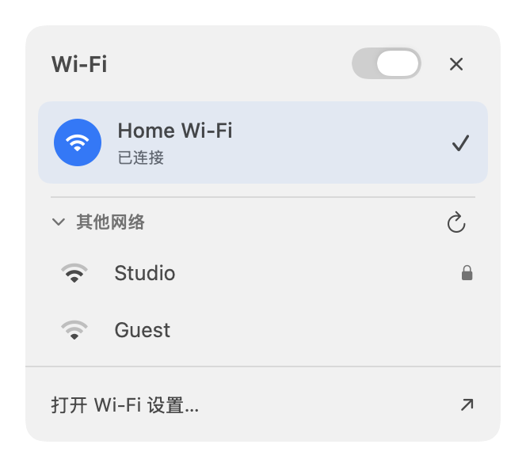
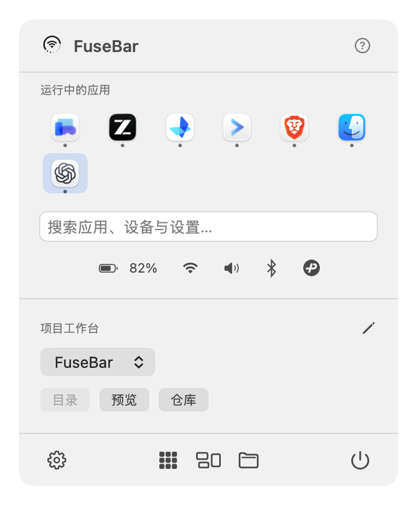
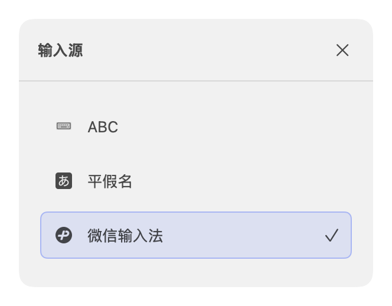
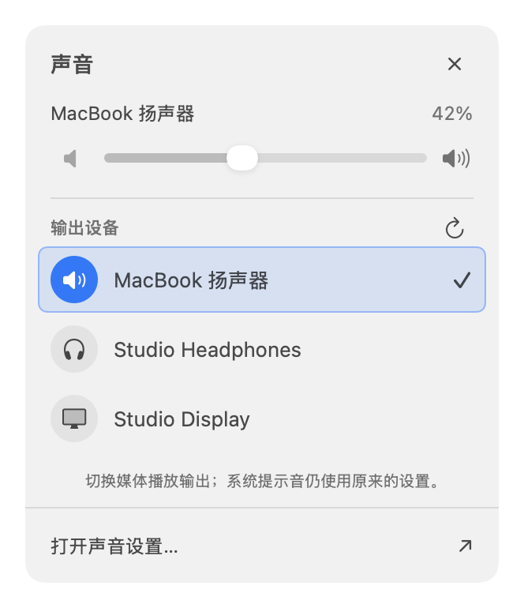
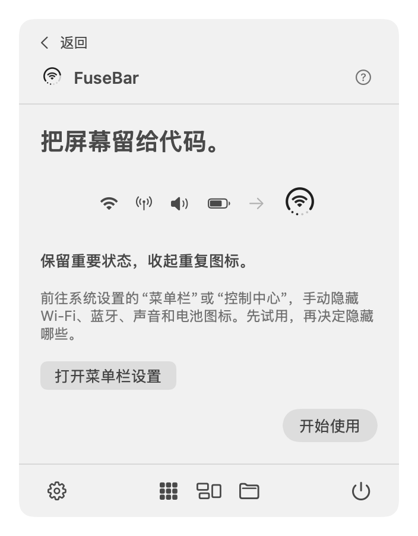
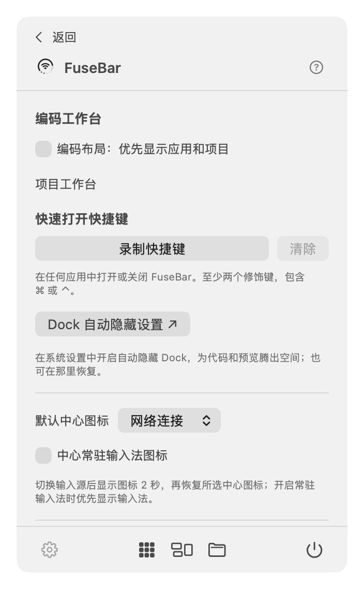
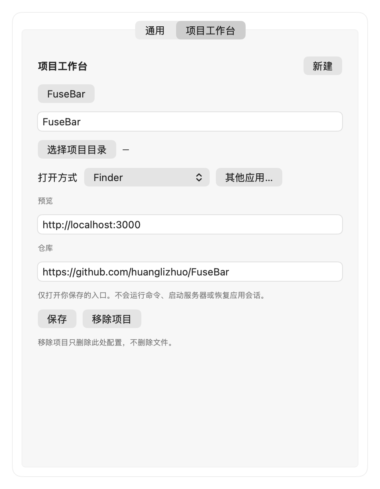

# FuseBar

[English](README.md) · **简体中文**


**给代码腾出空间，Mac 常用功能收进一个菜单栏图标。**

FuseBar 把系统状态、运行中的应用、输入源和项目入口收进菜单栏里的一个小面板。把 Dock 隐藏起来给编辑器腾地方，其他事交给 FuseBar：打字打开应用、切换声音输出、连接蓝牙设备，或者打开某个系统设置页面。

免费、原生，支持 macOS 14 及以上版本。无需账号，没有广告、订阅和数据统计。



## 下载

从 [GitHub Releases](https://github.com/huanglizhuo/FuseBar/releases/latest) 下载最新版本。应用同时支持 Apple 芯片和 Intel，使用 Developer ID 签名并经过 Apple 公证。FuseBar 不在 Mac App Store 上架。

把 FuseBar 移到“应用程序”文件夹后打开。它只在菜单栏显示，没有 Dock 图标；点击菜单栏上的圆环即可打开面板和首次使用引导。界面支持简体中文、英文、日文、法文和西班牙文，跟随 Mac 的首选语言。

## 功能

- **状态圆环**：圆环显示电量，中间显示网络或声音输出，四个小点表示音量。电量严重不足、Wi-Fi 断开或不可用、电量低、正在充电、静音时，底部会出现提示标记；也可以在设置中改为在底部显示电量或音量百分比。读不到的数值会留空或标为未知，不做猜测。
- **侧边菜单**：电池显示剩余使用时间和低电量模式；Wi-Fi 可以扫描并加入个人网络；蓝牙可以连接或断开已配对的设备；声音可以切换输出设备、调节音量。
- **搜索**：打字即可打开已安装的应用，支持应用名、首字母缩写（“vsc”）和拼音（“wx” 找到微信）。同一个搜索框还能切换声音输出、连接蓝牙设备、切换输入源，打开项目、收藏的文件和系统设置页面。每个结果都会写明按回车会执行什么。
- **运行中的应用**：搜索框上方最多显示 12 个，最近用过的排在前面。⌘1–⌘9 打开前九个；右键可以隐藏、在访达中显示或强制退出。
- **输入源**：用系统原生图标选择已启用的输入源。切换后圆环中间显示新输入源两秒，也可以设为一直显示。
- **编码布局**：紧凑的状态图标，加上每个项目的目录、预览和仓库链接。项目目录可以用你指定的应用打开，比如访达、Visual Studio Code、Cursor、Zed、Xcode 或终端。
- **键盘操作**：录制一个快速打开快捷键，按下就打开 FuseBar 并聚焦搜索框。↑/↓ 和回车选择结果，拼音组字时也能用；→ 打开状态的侧边菜单，← 关闭；Esc 先关侧边菜单，再关面板。
- **诊断信息**：设置中可以复制一份诊断摘要用于反馈问题，其中不含 Wi-Fi、设备、文件或项目名称。FuseBar 不会在后台检查更新。

## 截图







<details>
<summary>更多：输入源、声音、首次使用引导和设置窗口</summary>









</details>

介绍片和截图使用 FuseBar 的离屏渲染和示例数据，不是真机录屏或截屏。五种语言的全部截图见[截图索引](docs/previews/README.md)（英文）。

## 隐私

数据只保存在你的 Mac 上。蓝牙权限是可选的；只有当你希望显示 Wi-Fi 网络名称、扫描附近网络时，才会请求定位权限，而且 FuseBar 不会获取你的位置坐标。拒绝这些权限后，基本功能照常可用。详见[隐私政策](docs/PRIVACY.md)（英文）。

## 限制

- FuseBar 不会隐藏、移动或修改其他菜单栏图标，也不会改动你的 Dock 设置。重复的系统图标可以在“系统设置 → 菜单栏”（旧版 macOS 为“控制中心”）里手动隐藏；Dock 自动隐藏请通过“Dock 自动隐藏设置”链接自行开启。
- 通知中心、隐私指示灯和当前应用的菜单仍由 macOS 控制，详见[系统能力研究](docs/SYSTEM_CAPABILITY_RESEARCH.md)。
- Wi-Fi 状态只反映连接情况，不代表能访问互联网。部分低功耗蓝牙配件可能不会列出，部分外接音频设备不支持软件调节音量。
- 第三方输入法内部的模式切换可能不会改变系统输入源。

硬件覆盖情况和待验证项见[验证记录](docs/VALIDATION.md)。

## 构建

打开 `FuseBar.xcodeproj`，选择 **FuseBar** scheme。没有开发者证书时可以这样本地构建：

```sh
xcodebuild -project FuseBar.xcodeproj -scheme FuseBar -configuration Debug \
  -derivedDataPath build CODE_SIGN_IDENTITY=- CODE_SIGN_STYLE=Manual build
open build/Build/Products/Debug/FuseBar.app
```

配置好开发团队后，运行 `zsh Scripts/build.sh` 和 `zsh Scripts/test.sh`。工程以 `project.yml` 为准：添加文件或修改构建设置后运行 `xcodegen generate`。没有第三方运行时依赖。

## 更多

- [发布流程](Distribution/README.md)（英文） · [产品规划](docs/PLAN.md) · [应用图标设计](Design/AppIcon/DESIGN.md)
- 问题和建议请提交到 [GitHub Issues](https://github.com/huanglizhuo/FuseBar/issues)。
- 界面布局受 [CircleStatusBar](https://github.com/artemnovichkov/CircleStatusBar) 启发；FuseBar 的绘制与系统集成均为独立实现。
