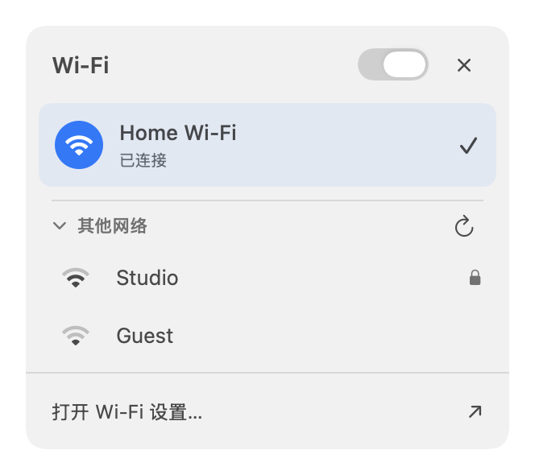
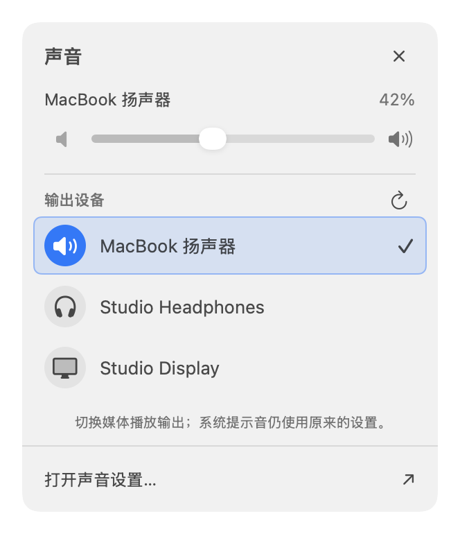

# Wi-Fi、声音、蓝牙菜单对照

2026-09-21。本轮参照 macOS Tahoe 的官方交互说明，重做三个设备子菜单。尝试使用电脑控制读取 ControlCenter（bundle ID 和系统应用路径）均返回 `timeoutReached`；Finder 可读取，但截图未包含可操作的系统状态菜单。因此以下是官方资料对照、源码检查和原生离屏验证，不是本机系统菜单的实测复刻。

## 对照与实现

| 项目 | 系统行为依据 | 原实现问题 | 本轮改动 |
| --- | --- | --- | --- |
| Wi-Fi | [Apple：从菜单选择网络、展开其他网络、按需输入密码](https://support.apple.com/en-euro/guide/mac-help/mchlp1180/26/mac/26) | 手动扫描才有列表，标题重复，固定空白，失败后目标消失 | 单标题与原生电源开关；已连接网络置顶；进入菜单且已授权/电源开启时扫描；可折叠其他网络、真实信号档位、加密标记；刷新保留列表；连接中显示进度，失败保留目标并清除密码 |
| 声音 | [Apple：输出选择与音量](https://support.apple.com/guide/mac-help/change-the-sound-output-settings-mchlp2256/26/mac/26)、[控制中心滑杆](https://support.apple.com/guide/mac-help/quickly-change-settings-mchl50f94f8f/26/mac/26) | 子菜单只有设备列表和静音，需返回主菜单调音量；设备插拔后需手动刷新 | 同一面板显示当前设备、音量、静音、输出列表；选中背景和勾选、目标行进度；监听设备集合与默认输出变化；不支持软件音量的设备显示说明 |
| 蓝牙 | [Apple：设备选择与连接/断开](https://support.apple.com/guide/mac-help/connect-a-bluetooth-device-blth1004/mac) | 仅设备名和状态，大块空白、重复标题 | 我的设备列表，连接设备优先，类别图标与连接状态；按后续要求，整行直接连接/断开，逐行显示进度，底部保留系统设置入口；权限/关闭/未知状态分别展示 |

共同采用 300 pt 子菜单、系统字体、语义颜色、紧凑设备行、按数量限制的滚动区和底部设置入口。当前连接同时通过文字/勾选表达，不只依赖颜色。沿用原生按钮焦点及现有悬停/按下样式。Wi-Fi 密码框保留左右移动光标，声音滑杆保留方向键调节；Escape 仍由原有子菜单生命周期处理。

## 能力边界

- 按用户后续明确要求，已配对蓝牙设备行直接调用公开 `IOBluetoothDevice.openConnection` / `closeConnection`，读回确认后更新状态；配对和总开关仍交给系统。连接链路和媒体输出路由分别核验，不宣称所有 BLE 设备或音频 profile 均已覆盖。HC3 名称已在同权限沙箱下核实；最终硬件验证范围见 VALIDATION。
- CoreAudio 的 Bluetooth 输出 UID 与设备地址精确对应时，优先使用系统音频名称，并在本机保留别名以在断开时显示。未知 UID 格式、非蓝牙输出或歧义名称不进行猜测。
- Wi-Fi 不读取保存密码、不保存输入密码、不后台周期扫描。企业认证、隐藏网络和 Instant Hotspot 继续交给系统。关闭 Wi-Fi 保留既有确认。
- 声音更改媒体默认输出，不改系统提示音输出。输出切换以 CoreAudio 回读为准。滑杆保留设备 UID 校验，设备变更期间不把旧手势写到新设备。
- 未新增运行依赖或权限，不更改系统菜单栏图标可见性、Orb 几何与位置。

## 预览

下图为示例数据的原生离屏渲染，不代表实时设备状态；离屏非活动窗口的原生开关/滑杆着色可能与活动菜单不同。

| Wi-Fi | 声音 | 蓝牙 |
| --- | --- | --- |
|  |  |  |

更多语言及深色版本见 [预览索引](previews/README.md)。构建、测试及未验收项目见 [验证记录](VALIDATION.md)。
